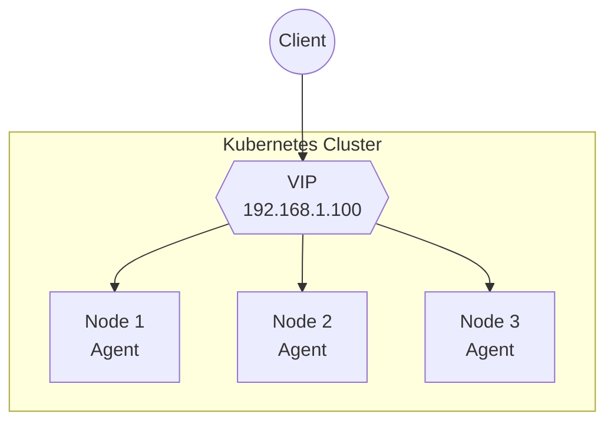
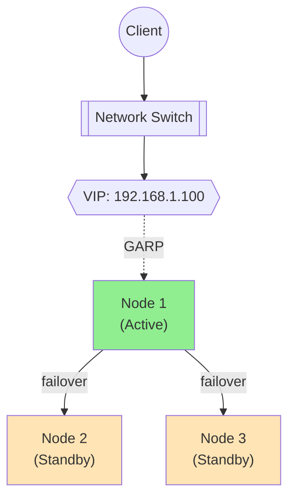
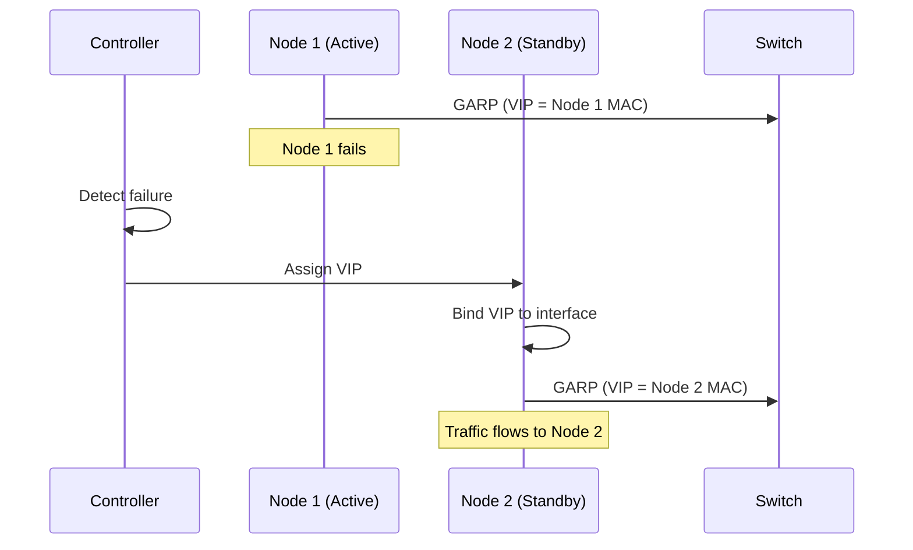
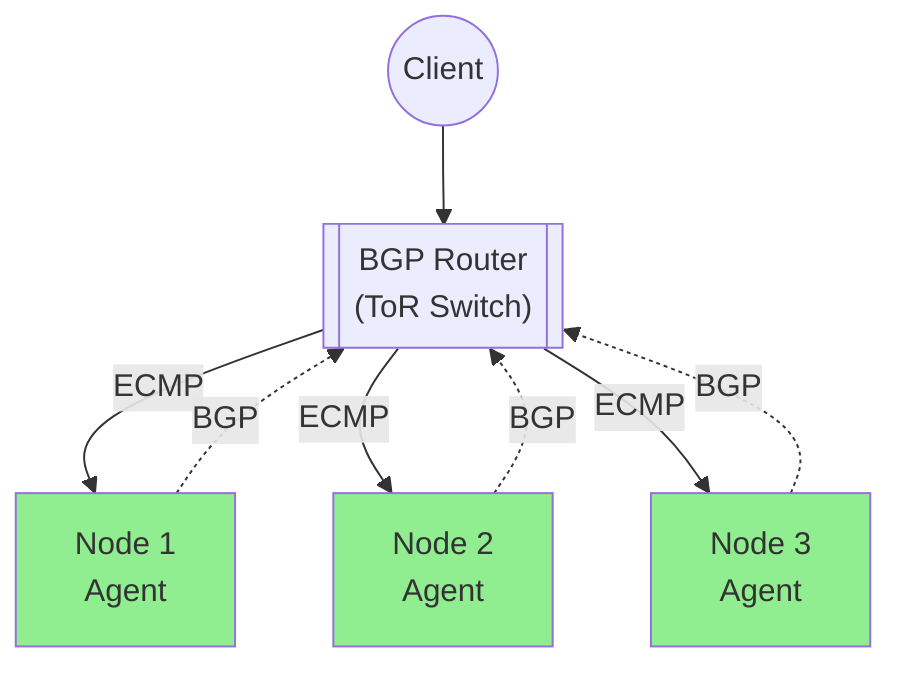
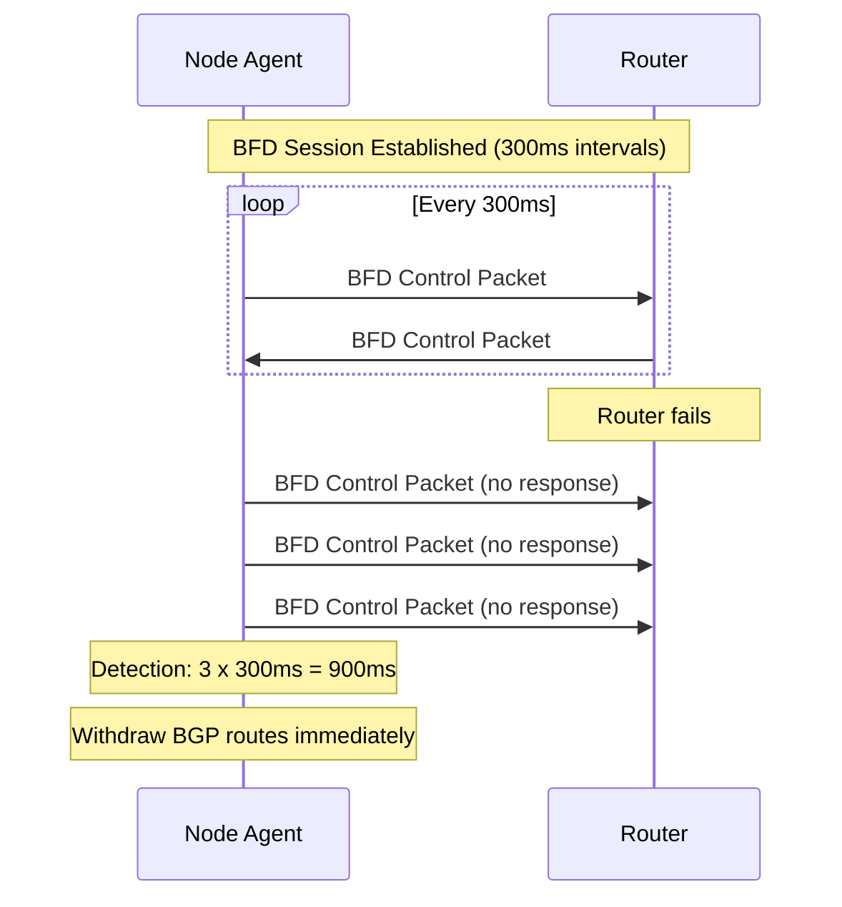
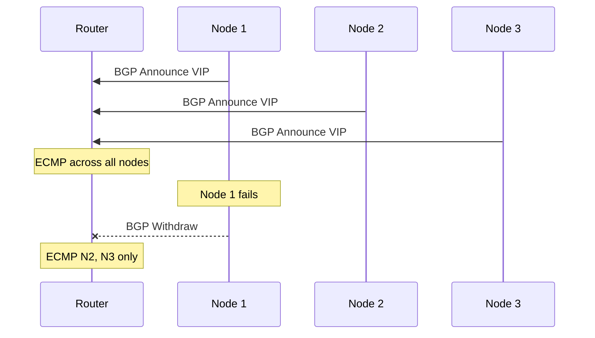
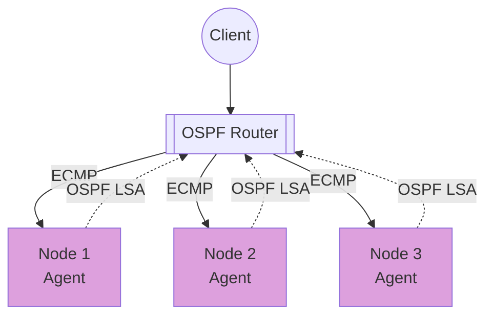
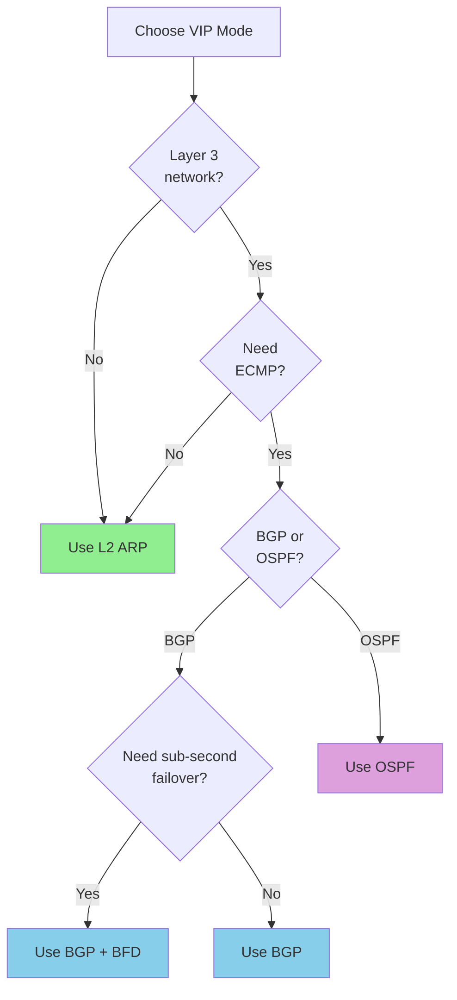

# VIP Management

Configure Virtual IP addresses for bare-metal and on-premises deployments.

## Overview

NovaEdge manages VIPs to provide external access to your services without cloud load balancers. It supports IPv4, IPv6, and dual-stack configurations with automatic IP address pool management.



## VIP Modes

| Mode | Description | Network | Availability | IPv6 |
|------|-------------|---------|--------------|------|
| L2 ARP | Single active node | Layer 2 | Active/Standby | NDP |
| BGP | All nodes announce | Layer 3 | Active/Active | Yes |
| OSPF | OSPF routing | Layer 3 | Active/Active | OSPFv3 |

## Address Families

NovaEdge supports three address family modes:

| Family | Description | Fields Used |
|--------|-------------|-------------|
| `ipv4` | IPv4 only (default) | `address` |
| `ipv6` | IPv6 only | `ipv6Address` |
| `dual` | Dual-stack (IPv4 + IPv6) | `address` + `ipv6Address` |

## L2 ARP Mode

Single node owns the VIP at a time. Uses Gratuitous ARP (IPv4) or Unsolicited Neighbor Advertisement (IPv6) for failover.



### IPv4 Configuration

```yaml
apiVersion: novaedge.io/v1alpha1
kind: ProxyVIP
metadata:
  name: main-vip
spec:
  address: 192.168.1.100/32
  mode: L2ARP
  addressFamily: ipv4
  ports:
    - 80
    - 443
```

### IPv6 Configuration

For IPv6-only L2 mode, NovaEdge sends Unsolicited Neighbor Advertisements (NDP) instead of Gratuitous ARP:

```yaml
apiVersion: novaedge.io/v1alpha1
kind: ProxyVIP
metadata:
  name: ipv6-vip
spec:
  ipv6Address: "2001:db8::100/128"
  mode: L2ARP
  addressFamily: ipv6
  ports:
    - 80
    - 443
```

### L2 Options

| Field | Default | Description |
|-------|---------|-------------|
| `address` | - | VIP IPv4 address with CIDR |
| `ipv6Address` | - | VIP IPv6 address with CIDR |
| `mode` | - | Must be `L2ARP` |
| `addressFamily` | `ipv4` | `ipv4`, `ipv6`, or `dual` |

### Requirements

- All nodes on same Layer 2 network
- Network allows Gratuitous ARP (IPv4) or NDP (IPv6)
- `NET_ADMIN` and `NET_RAW` capabilities

### Failover Process



## BGP Mode

All healthy nodes announce the VIP via BGP. Router performs ECMP.



### Configuration

```yaml
apiVersion: novaedge.io/v1alpha1
kind: ProxyVIP
metadata:
  name: bgp-vip
spec:
  address: 192.168.1.100/32
  mode: BGP
  addressFamily: ipv4
  ports:
    - 80
    - 443
  bgpConfig:
    localAS: 65000
    routerID: "10.0.0.1"
    peers:
      - address: "10.0.0.254"
        as: 65001
        port: 179
      - address: "10.0.0.253"
        as: 65001
        port: 179
```

### IPv6 BGP Peering

BGP supports IPv6 peers with MP_REACH_NLRI for IPv6 route announcements:

```yaml
apiVersion: novaedge.io/v1alpha1
kind: ProxyVIP
metadata:
  name: dual-stack-vip
spec:
  address: 10.200.0.50/32
  ipv6Address: "2001:db8::50/128"
  mode: BGP
  addressFamily: dual
  ports:
    - 80
    - 443
  bgpConfig:
    localAS: 65000
    routerID: "10.0.0.1"
    peers:
      - address: "10.0.0.254"
        as: 65001
```

### BGP Options

| Field | Default | Description |
|-------|---------|-------------|
| `bgpConfig.localAS` | - | Local BGP AS number |
| `bgpConfig.routerID` | - | BGP router ID |
| `bgpConfig.peers` | [] | List of BGP peers |
| `bgpConfig.peers[].address` | - | Peer IP address (IPv4 or IPv6) |
| `bgpConfig.peers[].as` | - | Peer AS number |
| `bgpConfig.peers[].port` | 179 | Peer BGP port |
| `bgpConfig.localASBase` | - | Base AS for eBGP per-node unique AS (see below) |
| `bgpConfig.communities` | [] | BGP communities to attach |
| `bgpConfig.localPreference` | 0 | Local preference for iBGP |

### eBGP ECMP Mode

By default, all nodes share the same `localAS` (iBGP). Some routers (e.g., MikroTik ROSv7) only install one best-path per prefix for iBGP peers, preventing ECMP across nodes.

Setting `localASBase` enables **eBGP mode**: each announcing node's local AS is computed as `localASBase + last_octet(nodeIP)`. Since every node has a unique AS, the upstream router treats each path as an eBGP path and installs all of them as ECMP next-hops automatically.

**AS number scheme example** (localASBase: 65000):

| Node | InternalIP | Local AS |
|------|-----------|----------|
| master-11 | 192.168.100.11 | 65011 |
| master-12 | 192.168.100.12 | 65012 |
| worker-21 | 192.168.100.21 | 65021 |
| worker-22 | 192.168.100.22 | 65022 |

```yaml
apiVersion: novaedge.io/v1alpha1
kind: ProxyVIP
metadata:
  name: ebgp-ecmp-vip
spec:
  address: 10.200.0.100/32
  mode: BGP
  addressFamily: ipv4
  ports:
    - 80
    - 443
  bgpConfig:
    localAS: 65000        # fallback for nodes where last-octet is 0
    localASBase: 65000    # enables eBGP: node AS = 65000 + last_octet(nodeIP)
    routerID: "0.0.0.0"  # auto-set to node's InternalIP by controller
    peers:
      - address: "10.0.0.254"
        as: 65000
      - address: "10.0.0.253"
        as: 65000
  bfd:
    enabled: true
```

On the upstream routers, configure each node connection as eBGP and ensure `ecmp` or `maximum-paths` is enabled. With eBGP, ECMP works automatically since each path originates from a different AS.

### BFD (Bidirectional Forwarding Detection)

BFD provides sub-second failure detection for BGP sessions. When a BFD session detects a peer failure, the corresponding BGP routes are immediately withdrawn.



#### BFD Configuration

```yaml
apiVersion: novaedge.io/v1alpha1
kind: ProxyVIP
metadata:
  name: bgp-vip-with-bfd
spec:
  address: 10.200.0.100/32
  mode: BGP
  addressFamily: ipv4
  ports:
    - 80
    - 443
  bgpConfig:
    localAS: 65000
    routerID: "10.0.0.1"
    peers:
      - address: "10.0.0.254"
        as: 65001
        port: 179
      - address: "10.0.0.253"
        as: 65001
        port: 179
  bfd:
    enabled: true
    detectMultiplier: 3
    desiredMinTxInterval: "300ms"
    requiredMinRxInterval: "300ms"
    echoMode: false
  nodeSelector:
    matchLabels:
      node-role.kubernetes.io/loadbalancer: "true"
```

#### BFD Options

| Field | Default | Description |
|-------|---------|-------------|
| `bfd.enabled` | `false` | Enable BFD for this VIP |
| `bfd.detectMultiplier` | `3` | Missed packets before session down |
| `bfd.desiredMinTxInterval` | `300ms` | Min TX interval (e.g., "300ms", "1s") |
| `bfd.requiredMinRxInterval` | `300ms` | Min RX interval |
| `bfd.echoMode` | `false` | Enable BFD echo mode |

#### BFD State Machine

BFD sessions follow the RFC 5880 state machine:

| State | Description |
|-------|-------------|
| `AdminDown` | Administratively disabled |
| `Down` | Session not established |
| `Init` | Local system wants session up |
| `Up` | Session established and operational |

### Router Configuration (Example: FRRouting)

```
router bgp 65001
 neighbor 10.0.0.1 remote-as 65000
 neighbor 10.0.0.2 remote-as 65000
 neighbor 10.0.0.3 remote-as 65000

 address-family ipv4 unicast
  maximum-paths 16
 exit-address-family
```

### Failover Process



## OSPF Mode

OSPF mode announces VIPs as AS-External LSAs for active-active load distribution. NovaEdge supports both OSPFv2 (IPv4) and OSPFv3 (IPv6).



### Configuration

```yaml
apiVersion: novaedge.io/v1alpha1
kind: ProxyVIP
metadata:
  name: ospf-vip
spec:
  address: 10.200.0.200/32
  mode: OSPF
  addressFamily: ipv4
  ports:
    - 80
    - 443
  ospfConfig:
    routerID: "10.0.0.1"
    areaID: 0
    cost: 10
    helloInterval: 10
    deadInterval: 40
    authType: md5
    authKey: "mySecretKey"
    gracefulRestart: true
```

### OSPF Options

| Field | Default | Description |
|-------|---------|-------------|
| `ospfConfig.routerID` | - | OSPF router ID (required) |
| `ospfConfig.areaID` | `0` | OSPF area (0 = backbone) |
| `ospfConfig.cost` | `10` | Route metric cost |
| `ospfConfig.helloInterval` | `10` | Hello interval (seconds) |
| `ospfConfig.deadInterval` | `40` | Dead interval (seconds) |
| `ospfConfig.authType` | `none` | Auth: `none`, `plaintext`, `md5` |
| `ospfConfig.authKey` | - | Authentication key |
| `ospfConfig.gracefulRestart` | `false` | Enable OSPF graceful restart |

### OSPFv3 (IPv6)

For IPv6 networks, OSPF automatically uses OSPFv3:

```yaml
apiVersion: novaedge.io/v1alpha1
kind: ProxyVIP
metadata:
  name: ospf-ipv6-vip
spec:
  ipv6Address: "2001:db8::200/128"
  mode: OSPF
  addressFamily: ipv6
  ports:
    - 80
    - 443
  ospfConfig:
    routerID: "10.0.0.1"
    areaID: 0
    cost: 10
```

### OSPF Neighbor States

The OSPF implementation tracks neighbor states through the full state machine:

| State | Description |
|-------|-------------|
| Down | No recent hello received |
| Init | Hello received, waiting for 2-way |
| 2-Way | Bidirectional communication established |
| ExStart | Database exchange starting |
| Exchange | Database description exchange |
| Loading | Loading LSAs from neighbor |
| Full | Fully adjacent, LSDBs synchronized |

## IP Address Pools

For dynamic VIP address assignment, use `ProxyIPPool` resources. See [IP Address Pools](ip-pools.md) for full documentation.

```yaml
apiVersion: novaedge.io/v1alpha1
kind: ProxyIPPool
metadata:
  name: main-vip-pool
spec:
  cidrs:
    - "10.200.0.0/24"
  autoAssign: true
---
apiVersion: novaedge.io/v1alpha1
kind: ProxyVIP
metadata:
  name: auto-assigned-vip
spec:
  mode: BGP
  addressFamily: ipv4
  ports:
    - 80
  poolRef:
    name: main-vip-pool
  bgpConfig:
    localAS: 65000
    routerID: "10.0.0.1"
    peers:
      - address: "10.0.0.254"
        as: 65001
```

## Multiple VIPs

Create multiple VIPs for different services:

```yaml
---
apiVersion: novaedge.io/v1alpha1
kind: ProxyVIP
metadata:
  name: web-vip
spec:
  address: 192.168.1.100/32
  mode: L2ARP
  addressFamily: ipv4
  ports:
    - 80
    - 443
---
apiVersion: novaedge.io/v1alpha1
kind: ProxyVIP
metadata:
  name: api-vip
spec:
  address: 192.168.1.101/32
  mode: L2ARP
  addressFamily: ipv4
  ports:
    - 8080
```

## VIP Status

Check VIP status:

```bash
# Get VIP status
kubectl get proxyvip

# Detailed status
kubectl describe proxyvip main-vip

# Using novactl
novactl get vips
novactl describe vip main-vip
```

Example output:

```
NAME              ADDRESS            MODE   FAMILY   BFD   ACTIVE NODE   AGE
main-vip          192.168.1.100/32   L2ARP  ipv4           node-1        5h
bgp-vip           10.200.0.100/32    BGP    ipv4     Up    <all>         3h
dual-stack-vip    10.200.0.50/32     BGP    dual     Up    <all>         1h
ipv6-vip          2001:db8::100/128  L2ARP  ipv6           node-2        30m
```

Example status:

```yaml
status:
  activeNode: node-1
  bfdSessionState: Up
  allocatedAddress: "10.200.0.5/32"
  conditions:
    - type: Bound
      status: "True"
      reason: VIPAssigned
      message: VIP assigned to node-1
```

## Choosing a Mode



| Scenario | Recommended Mode |
|----------|------------------|
| Simple L2 network | L2 ARP |
| Data center with ToR switches | BGP |
| Sub-second failover needed | BGP + BFD |
| OSPF-only environment | OSPF |
| Need active/active | BGP or OSPF |
| IPv6-only network | L2ARP (NDP), BGP, or OSPF (v3) |
| Dual-stack environment | BGP or OSPF with `dual` family |
| Dynamic VIP assignment | Any mode + IP Pool |
| Cloud environment | Use cloud LB instead |

## Node Affinity

Control which nodes can own VIPs:

```yaml
apiVersion: novaedge.io/v1alpha1
kind: ProxyVIP
metadata:
  name: main-vip
spec:
  address: 192.168.1.100/32
  mode: L2ARP
  addressFamily: ipv4
  ports:
    - 80
  nodeSelector:
    matchLabels:
      node-role.kubernetes.io/loadbalancer: "true"
```

## Default Node Exclusions

By default, all ready nodes are candidates for VIP scheduling. You can configure cluster-wide exclusions in `NovaEdgeCluster` so that new VIPs automatically avoid certain node groups — without requiring a `nodeSelector` on every VIP.

This works analogously to Kubernetes taints and tolerations: nodes carrying an excluded label key are "tainted" for VIPs. A VIP with a matching `toleration` opts in to those nodes.

### Configure cluster-wide exclusions

```yaml
apiVersion: novaedge.io/v1alpha1
kind: NovaEdgeCluster
metadata:
  name: novaedge
spec:
  vipNodeExclusions:
    - node-role.kubernetes.io/control-plane   # exclude master nodes by default
```

All new and existing VIPs will automatically avoid nodes carrying this label.

### Allow a specific VIP on excluded nodes

Use `tolerations` alongside `nodeSelector` to target excluded nodes (e.g., for a control-plane VIP):

```yaml
apiVersion: novaedge.io/v1alpha1
kind: ProxyVIP
metadata:
  name: cp-vip
spec:
  address: 192.168.100.10/32
  mode: BGP
  ports:
    - 6443
  tolerations:
    - node-role.kubernetes.io/control-plane   # opt in to masters
  nodeSelector:
    matchLabels:
      node-role.kubernetes.io/control-plane: "true"   # restrict to masters only
  bgpConfig:
    localAS: 65000
    peers:
      - address: "192.168.100.2"
        as: 65000
```

`tolerations` removes the exclusion constraint (widens the candidate set); `nodeSelector` then narrows it to the desired nodes. Both are needed when targeting excluded nodes exclusively.

### Multiple exclusion keys

```yaml
# NovaEdgeCluster — exclude both control-plane and GPU nodes
spec:
  vipNodeExclusions:
    - node-role.kubernetes.io/control-plane
    - accelerator

---
# ProxyVIP — tolerate control-plane but not GPU nodes
spec:
  tolerations:
    - node-role.kubernetes.io/control-plane   # tolerated — may run on masters
    # accelerator not listed → GPU nodes remain excluded
```

## Troubleshooting

### VIP Not Reachable

```bash
# Check VIP status
kubectl get proxyvip main-vip -o yaml

# Check agent logs
kubectl logs -n novaedge-system -l app.kubernetes.io/name=novaedge-agent | grep -i vip

# Verify interface binding (on the active node)
ip addr show eth0
```

### L2 ARP Issues

```bash
# Check ARP table on client
arp -a | grep 192.168.1.100

# Send test ARP from node
arping -I eth0 192.168.1.100

# For IPv6, check NDP
ip -6 neigh show
```

### BGP Issues

```bash
# Check BGP session status
kubectl exec -n novaedge-system <agent-pod> -- novactl bgp status

# Verify routes on router
show ip bgp summary
show ip route 192.168.1.100
```

### BFD Issues

```bash
# Check BFD session state in VIP status
kubectl get proxyvip -o wide

# Check BFD metrics
curl -s http://<agent-ip>:9090/metrics | grep bfd
```

### OSPF Issues

```bash
# Check OSPF neighbor states
kubectl logs -n novaedge-system <agent-pod> | grep ospf

# Verify OSPF routes on router
show ip ospf neighbor
show ip ospf database external
```

## Metrics

| Metric | Description |
|--------|-------------|
| `novaedge_vip_bound` | VIP bound status (1=bound) |
| `novaedge_vip_failovers_total` | Number of failovers |
| `novaedge_bgp_session_state` | BGP session state |
| `novaedge_bgp_routes_announced` | Routes announced via BGP |
| `novaedge_bfd_session_state` | BFD session state gauge |
| `novaedge_bfd_packet_rx_total` | BFD packets received |
| `novaedge_bfd_packet_tx_total` | BFD packets sent |
| `novaedge_bfd_session_flaps_total` | BFD session flap count |
| `novaedge_ospf_neighbor_state` | OSPF neighbor adjacency state |
| `novaedge_ospf_lsdb_count` | OSPF link-state database entries |

## Next Steps

- [K3s Control Plane HA](k3s-control-plane-ha.md) - Deploy NovaEdge as kube-vip replacement on K3s
- [IP Address Pools](ip-pools.md) - Dynamic VIP address management
- [Routing](routing.md) - Configure routes
- [Load Balancing](load-balancing.md) - LB algorithms
- [Observability](../operations/observability.md) - Monitoring
