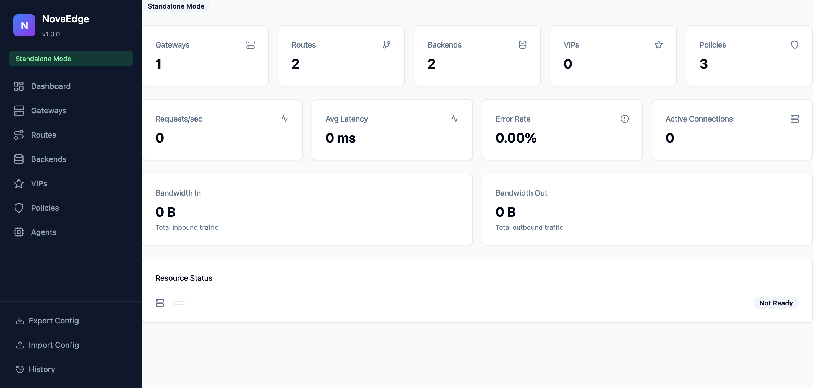
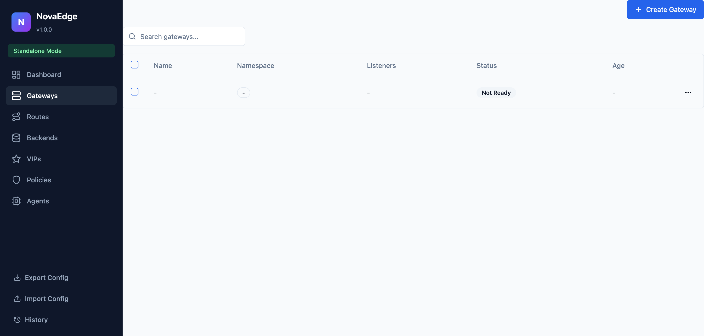
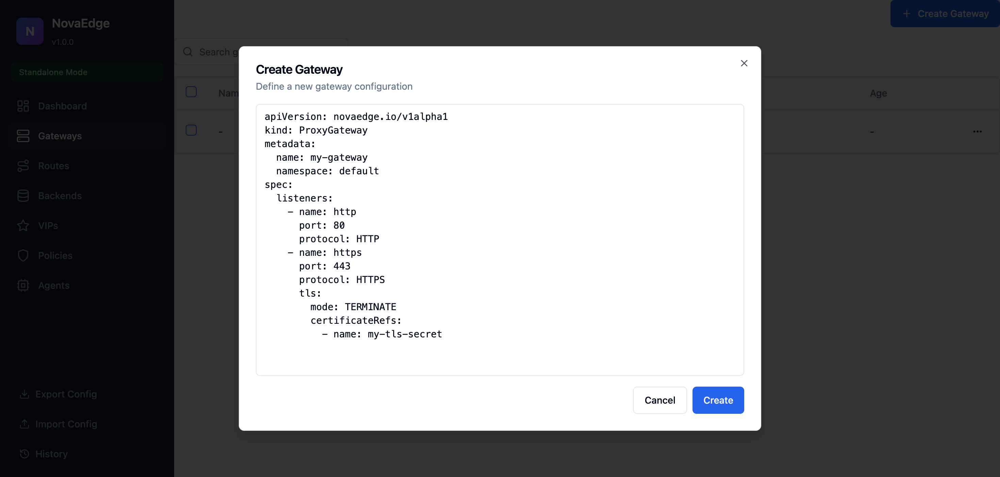
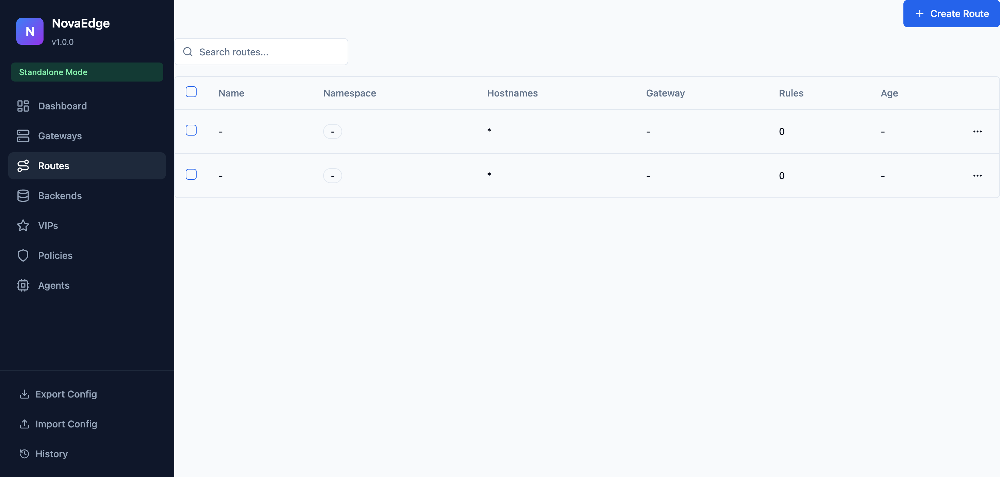
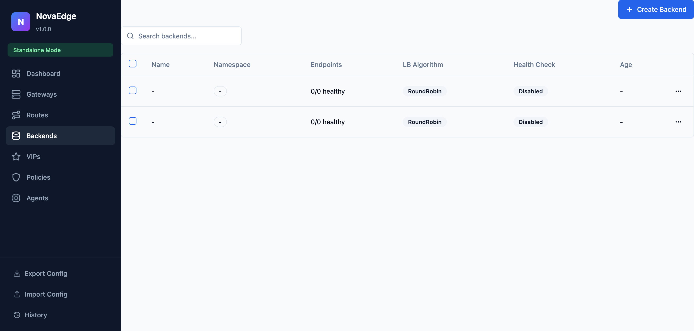
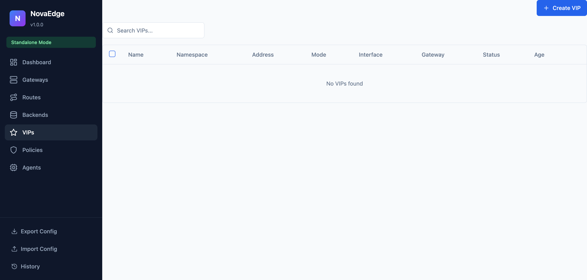
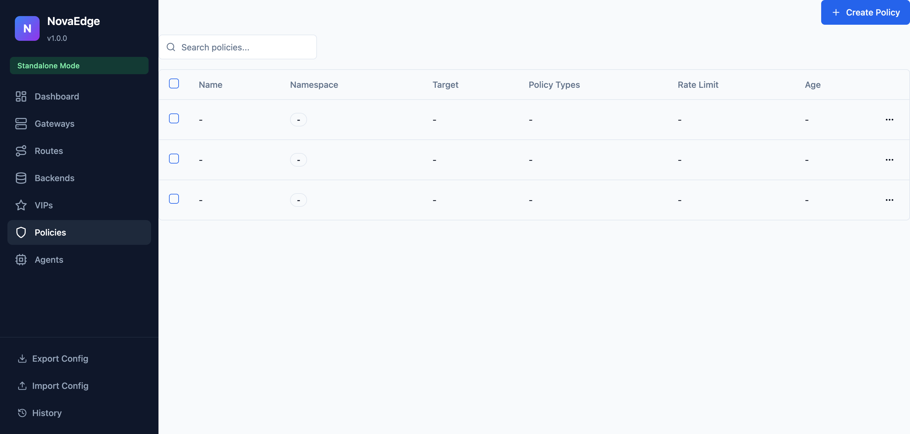
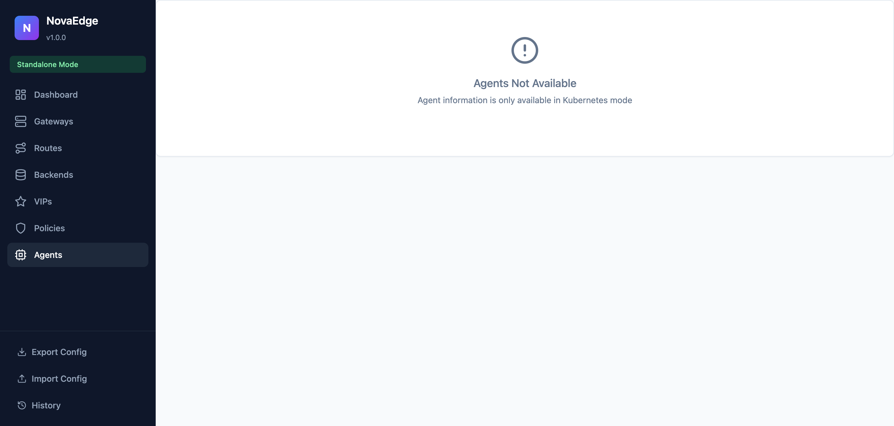
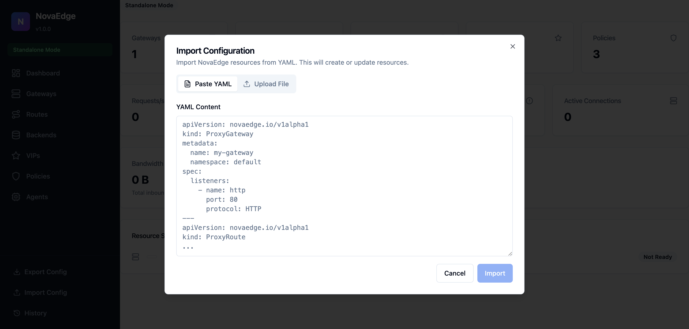

# Web UI Guide

NovaEdge includes a built-in web-based dashboard for monitoring and managing your proxy configuration. The dashboard provides real-time visibility into your infrastructure and allows you to create, update, and delete resources through an intuitive interface.

## Starting the Web UI

The web UI is launched using the `novactl web` command:

```bash
# Start on default port 9080
novactl web

# Start on a custom port
novactl web --address :8080

# Start with Prometheus metrics integration
novactl web --prometheus-endpoint http://prometheus:9090

# Start in standalone mode with a config file
novactl web --mode standalone --standalone-config /etc/novaedge/config.yaml

# Start in read-only mode (view only, no modifications allowed)
novactl web --read-only

# Start and automatically open in browser
novactl web --open
```

### TLS Configuration

The web UI supports TLS for secure access:

```bash
# Use manual TLS certificates
novactl web --tls-cert /path/to/cert.pem --tls-key /path/to/key.pem

# Auto-generate a self-signed certificate
novactl web --tls-auto

# Self-signed certificate for a specific domain
novactl web --tls-auto --acme-domain dashboard.example.com
```

## Operating Modes

The web UI supports two operating modes:

| Mode | Description |
|------|-------------|
| **Kubernetes** | Uses Kubernetes CRDs to manage configuration. Requires access to a Kubernetes cluster. |
| **Standalone** | Uses a YAML configuration file for non-Kubernetes deployments. |

The mode is auto-detected based on available configuration, but can be explicitly set with `--mode kubernetes` or `--mode standalone`.

## Dashboard Overview

The dashboard provides an at-a-glance view of your NovaEdge deployment:



### Key Metrics

The dashboard displays real-time metrics including:

- **Resource Counts**: Number of Gateways, Routes, Backends, VIPs, and Policies
- **Requests/sec**: Current request throughput
- **Avg Latency**: Average request latency
- **Error Rate**: Percentage of failed requests
- **Active Connections**: Current number of active connections
- **Bandwidth In/Out**: Total inbound and outbound traffic
- **Resource Status**: Overall health status of the deployment

## Navigation

The sidebar provides navigation to all resource management pages:

- **Dashboard**: Overview and metrics
- **Gateways**: Manage gateway listeners and TLS configuration
- **Routes**: Configure routing rules and traffic matching
- **Backends**: Define backend services and load balancing
- **VIPs**: Manage virtual IP addresses
- **Policies**: Configure rate limiting, CORS, JWT, and IP filtering
- **Agents**: View agent status and health

## Gateways

The Gateways page displays all configured gateway resources:



### Gateway Features

- **Search**: Filter gateways by name
- **Create**: Add new gateway configurations
- **Edit**: Modify existing gateways
- **Delete**: Remove gateway configurations
- **Bulk Actions**: Select multiple gateways for batch operations

### Creating a Gateway

Click "Create Gateway" to open the creation dialog:



The dialog provides a YAML editor with a template for the gateway configuration. You can define:

- Gateway name and namespace
- Listeners (HTTP, HTTPS, TCP)
- TLS configuration
- Hostnames

## Routes

The Routes page manages traffic routing rules:



### Route Configuration

Each route defines:

- **Hostnames**: Which domains the route matches
- **Path Matching**: URL path patterns (exact, prefix, regex)
- **Header Matching**: Match requests based on headers
- **Backend References**: Which backends receive the traffic
- **Filters**: Request/response modifications

## Backends

The Backends page configures upstream services:



### Backend Features

- **Endpoints**: List of backend server addresses
- **Load Balancing Algorithm**: RoundRobin, P2C, EWMA, RingHash, Maglev
- **Health Checks**: HTTP or TCP health checking configuration
- **Circuit Breaker**: Failure detection and recovery settings
- **Connection Pool**: Connection management settings

## VIPs

The VIPs page manages Virtual IP addresses:



### VIP Modes

- **L2 (ARP)**: Layer 2 failover using ARP announcements
- **BGP**: BGP-based anycast for multi-node distribution
- **OSPF**: OSPF-based routing announcements

## Policies

The Policies page configures traffic policies:



### Policy Types

| Type | Description |
|------|-------------|
| **RateLimit** | Limit requests per second with token bucket algorithm |
| **CORS** | Cross-Origin Resource Sharing configuration |
| **JWT** | JSON Web Token validation |
| **IPFilter** | Allow/deny lists based on IP addresses |
| **SecurityHeaders** | Add security-related HTTP headers |

## Agents

The Agents page displays NovaEdge agent status:



In Kubernetes mode, this shows all agent pods running as a DaemonSet. In standalone mode, it displays the local agent status.

## Import/Export Configuration

### Exporting Configuration

Click "Export Config" in the sidebar to download the current configuration as a YAML file. This is useful for:

- Backup and disaster recovery
- Migrating between environments
- Version control of configuration

### Importing Configuration

Click "Import Config" to open the import dialog:



You can either:

- **Paste YAML**: Directly paste YAML content into the text area
- **Upload File**: Select a YAML file from your computer

The import will create or update resources based on the YAML content.

## Configuration History

Click "History" in the sidebar to view recent configuration changes. This provides an audit trail of modifications made through the web UI.

## Keyboard Shortcuts

| Shortcut | Action |
|----------|--------|
| `F8` | Toggle notifications panel |
| `Escape` | Close dialogs |

## Security Considerations

### Authentication

By default, the web UI does not require authentication. For production deployments, consider:

1. **Running behind NovaEdge itself** with JWT authentication
2. **Using TLS** with client certificates
3. **Network-level restrictions** (firewall, VPN)

See the [Management Plane Protection](deployment-guide.md#management-plane-protection) section for details on securing the web UI.

### Read-Only Mode

Use `--read-only` flag to prevent any modifications through the web UI:

```bash
novactl web --read-only
```

This is recommended for monitoring dashboards in production environments.

## Troubleshooting

### Web UI Not Loading

1. Check if the port is available: `lsof -i :9080`
2. Verify novactl is running: `ps aux | grep novactl`
3. Check for errors in the terminal output

### No Metrics Displayed

1. Verify Prometheus endpoint is accessible
2. Check the `--prometheus-endpoint` flag value
3. Ensure NovaEdge agents are exposing metrics

### Resources Not Appearing

1. In Kubernetes mode, verify RBAC permissions
2. In standalone mode, check the config file path
3. Refresh the page or check browser console for errors

## See Also

- [Deployment Guide](deployment-guide.md)
- [novactl Reference](../reference/novactl-reference.md)
- [Standalone Mode](standalone-mode.md)
